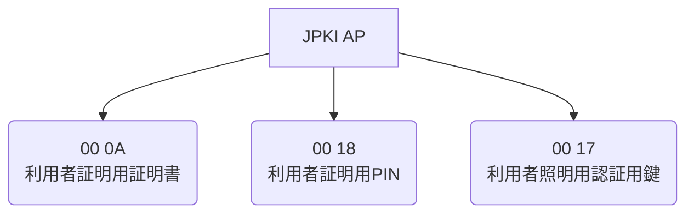
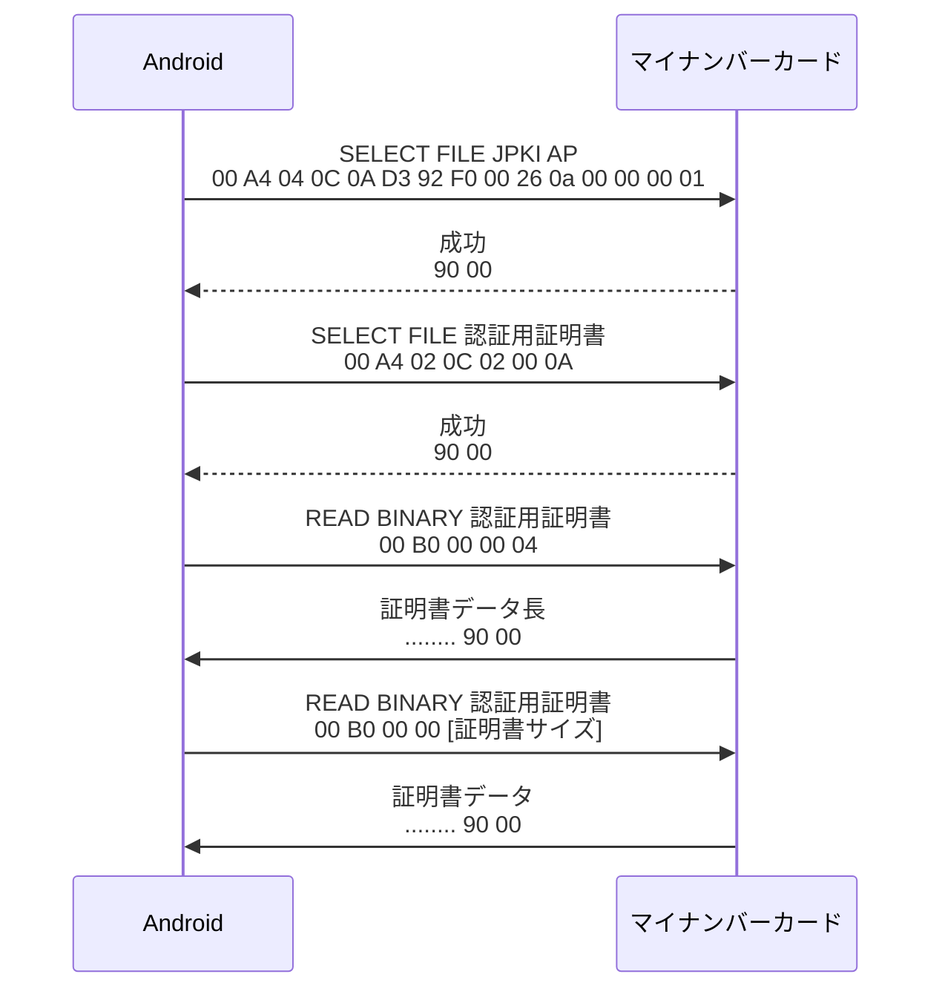
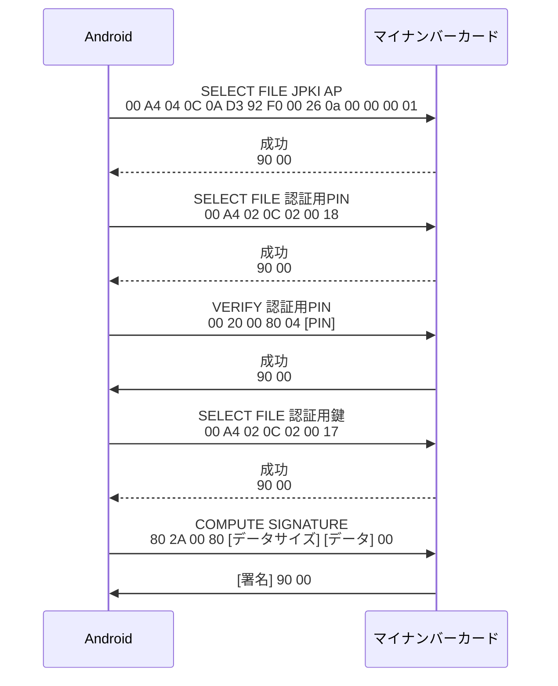

::: message
この記事は[Android Advent Calendar 2023](https://qiita.com/advent-calendar/2023/android)の13日目の記事です。  
今日は17日ですが、枠が空いていたので遡ってねじ込みました。  
初Advent Calendarです。
:::

::: message alert
この記事で、マイナンバーカードの中身を取得することに触れていますが、カードにロックがかかるなど、すべての事項において自己責任でお願いいたします。
:::


## はじめに
マイナンバーカードの仕組みが制定されてからだいぶ経ちましたが、皆さんは発行しましたか？  
発行していない方、便利なので発行しましょう（政府の回し者ではありません）

## マイナンバーカードとは何か
デジタル庁の説明では、以下のようにされています。
>マイナンバーカードは、マイナンバーを証明する書類として利用できるだけでなく、本人確認書類としての利用、各種行政手続きのオンライン申請、各種民間のオンライン取引など、日常生活の中で利用できるシーンがどんどん広がっています。
[デジタル庁](https://www.digital.go.jp/policies/mynumber/pros-and-safety/)

つまり、便利カードってわけですね。  
最近では、保険証利用が始まったり、免許証の機能も入れようみたいな話もあったかもしれません。気のせいだったかもしれません。


### マイナンバーカードの仕様
さて、このマイナンバーカードですが、単なるカードにとどまらず、中に入っているICチップには様々なアプリケーションが搭載されています。  
またまたデジタル庁のサイトから引用しますが、ざっと以下のようなものが入っています。


今回は、JPKI（公的個人認証）APのなかでも、利用者証明を用いてファイルに署名をしてみたいと思います。 
JPKI APの中をさらに掘り下げると、以下のような構造になっています。




### プロトコル
マイナンバーカードと通信するにあたって、NFCを利用します。ちなみにType-Bです。また、ICチップへの命令はADPUと呼ばれるバイト列を送信して行います。  
概ね以下のような形式になっているようです。

#### Command ADPU
Comand ADPUとは、ICチップに命令を発行するときのADPUになります。

| CLA | INS | P1 | P2 | Lc | Data Field | Le |　　
| :----: | :----: | :----: | :----: | :----: | :----: | :----: |  
| 種別 | 命令 | 引数1 | 引数2 | 送信データサイズ | 送信データ | 受信データサイズ |
| 1 byte | 1 byte | 1 byte | 1 byte | 0-3 byte | 0-32768(?) byte | 0-3 byte |


#### Response ADPU
こちらも見たままの意味で、レスポンス時のバイト列ですね。

| body | SW1 | SW2 |
| :----: | :----: | :----: |
| データ | ステータス1 | ステータス2 |
| 0 ~ ? byte | 1 byte | 1 byte |

ここで、SW1とSW2は基本的に`0x90`, `0x00` という値を取ります。  
が、コマンドによって異なることもあり、例えばロックされるまでの回数を問い合わせると `0x63`, `0xC?(?は0~3)` という値になったりします。 


というわけで、Androidでマイナンバーカードを読み取っていろいろ遊んでみます。

### 証明書を取得する
まずは利用者証明書の公開鍵を取得してみます。このとき、次のようなフローで命令をしていくことで公開鍵を取得することができます。  
手順としては、  

- JPKI APを選択
- 認証用証明書を選択
- 証明書のデータ長を読み出す
- 証明書本体を読み出す

という4工程になります。



### ファイルに署名する
続いて、ファイルに署名してみます。  
こちらも手順としては  

- JPKI APを選択
- 認証用PINを選択
- 認証用PINを照合
- 認証用鍵を選択
- 署名対象のデータを投げつける

の5工程ですね。



### やり取りするデータに関して
マイナンバーカードとのやり取りは、ASN.1なDERを用いて行います。これに関して、[これ](https://qiita.com/ishihatta/items/7e541b64ade4bb3834da#%E3%83%9D%E3%82%A4%E3%83%B3%E3%83%88%EF%BC%91asn1-%E3%81%AE%E3%83%91%E3%83%BC%E3%82%B9)を参考にさせていただきました。  
掻い摘むと、バイナリ化された構造データのようです。ProtoBufを思い浮かべるとわかりやすいかもしれません。

## 実装してみる
実装するにあたって、まずはいろんな型を作っていきます。  
まずは Command ADPUですね。これはプロトコル通りに実装します。

::: details Command ADPUの実装
```kotlin CommandAdpu.kt
data class CommandAdpu(
    val CLA: Byte,
    val INS: Byte,
    val P1: Byte,
    val P2: Byte,
    val Lc: ByteArray = byteArrayOf(),
    val DF: ByteArray = byteArrayOf(),
    val Le: ByteArray = byteArrayOf()){
    fun toAdpu() = byteArrayOf(CLA, INS, P1, P2).plus(Lc).plus(DF).plus(Le)
}
```
:::

同じように、 Response ADPUもプロトコル通りに実装していきます。  
また、（ちょっと汚いですが）ASN.1のコンバータも内包してしまいましょう。

::: details Response ADPUの実装

```Kotlin : ResponseAdpu.kt
data class ResponseAdpu(val rawData: ByteArray) {
    lateinit var data: ByteArray
    var SW1: Byte = 0x00
    var SW2: Byte = 0x00

    fun validate(sw1: Byte = 0x90.toByte(), sw2: Byte = 0x00): Boolean{
        val sw = rawData.takeLast(2)
        if(sw.get(0) != sw1 || sw.get(1) != sw2){
            return false
        }

        data = rawData.dropLast(2).toByteArray()
        SW1 = rawData.takeLast(2).first()
        SW2 = rawData.last()

        return true
    }

    fun asn1FrameIterator() = rawData.asn1FrameIterator()


    data class ASN1Frame(
        val tag: Int,
        val length: Int,
        val frameSize: Int,
        val value: ByteArray? = null
    )

    fun ByteArray.asn1FrameIterator(): Iterator<ASN1Frame> {
        return object: Iterator<ASN1Frame> {
            private val decoder = DERDecoder()
            private val byteArrayInputStream = ByteArrayInputStream(this@asn1FrameIterator)
            private val asn1InputStream = ASN1InputStream(decoder, byteArrayInputStream)

            override fun hasNext(): Boolean = byteArrayInputStream.available() > 0

            override fun next(): ASN1Frame {
                if (!hasNext()) throw NoSuchElementException()
                val tag = decoder.readTag(asn1InputStream)
                val length = decoder.readLength(asn1InputStream)
                val position = this@asn1FrameIterator.size - byteArrayInputStream.available()
                val frameSize = length + position
                val value: ByteArray? = try {
                    decoder.readValue(length, asn1InputStream)
                } catch (e: Exception) {
                    null
                }
                return ASN1Frame(tag.tag, length, frameSize, value)
            }
        }
    }
}
```
:::

あとは、ADPU本体ですね。通信処理と、バリデーションを任せているだけです。
::: details ADPUの実装

```Kotlin : Adpu.kt```
class Adpu(val isoDep: IsoDep) {
    fun transceive(command: CommandAdpu, sw1: Byte = 0x90.toByte(), sw2: Byte = 0x00, validate: Boolean = true): ResponseAdpu{
        val response = isoDep.transceive(command.toAdpu())
        val responseAdpu = ResponseAdpu(rawData = response)
        if(validate) {
            if(responseAdpu.validate(sw1, sw2).not()){
                throw AdpuValidateException("ADPUコマンドの結果が異常です")
            }
        }

        return responseAdpu
    }
}

::: 

これで準備ができたので、実装していきたいと思います。  

### JPKI APの選択
だいたい以下のような実装になります。

```Kotlin 
fun selectJpki(tag: Tag){
    val isoDep = IsoDep.get(tag)
    val selectFileAdpu = CommandAdpu(
        CLA = 0x00,
        INS = 0xA4.toByte(),
        P1 = 0x04,
        P2 = 0x0C,
        Lc = byteArrayOf(0x0A),
        DF = byteArrayOf(0xD3.toByte(), 0x92.toByte(), 0xF0.toByte(), 0x00, 0x26, 0x01, 0x00, 0x00, 0x00, 0x01)
    )
    Adpu(isoDep).transceive(selectFileAdpu)
}
```

### 認証用証明書の選択
続いて、認証用証明書を選択します。
```Kotlin 
fun selectCertificateAuth(tag: Tag){
    val isoDep = IsoDep.get(tag)
    val selectFileAdpu = CommandAdpu(
        CLA = 0x00,
        INS = 0xA4.toByte(),
        P1 = 0x02,
        P2 = 0x0C,
        Lc = byteArrayOf(0x02),
        DF = byteArrayOf(0x00, 0x0A.toByte())
    )
    Adpu(isoDep).transceive(selectFileAdpu)
}
```

### 認証用証明書の読み出し
認証用証明書の読み出しは、だいたい以下のような感じです。

```Kotlin
fun readCertificateAuth(tag: Tag): X509Certificate{
    selectJpki(tag)
    selectCertificateAuth(tag)

    val isoDep = IsoDep.get(tag)
    val adpu = Adpu(isoDep)

    val preloadAdpu = CommandAdpu(
        CLA = 0x00,
        INS = 0xB0.toByte(),
        P1 = 0x00,
        P2 = 0x00,
        Le = byteArrayOf(0x04))
    val preloadResponse = adpu.transceive(preloadAdpu)
    val preloadAsn1 = preloadResponse.asn1FrameIterator().next().frameSize


    val readCertificateAdpu = CommandAdpu(
        CLA = 0x00,
        INS = 0xB0.toByte(),
        P1 = 0x00,
        P2 = 0x00,
        Le = preloadAsn1.toByteArray())
    val certificateByteArray = adpu.transceive(readCertificateAdpu)

    // X.509形式に変換
    val cert = CertificateFactory.getInstance("X.509").generateCertificate(ByteArrayInputStream(certificateByteArray.data)) as X509Certificate

    return cert
}
```

おおよその流れは、先に説明した手順のとおりです。  
最後、証明書をX.509形式に変換するために、標準の `CertificateFactory`を使って読み込んで変換をかけています。

### 認証用PINの解除
ざっくり、以下のような形になります。  
`Pin`には4桁のPINコードが入っていると思ってください。

```Kotlin 
fun verifyAuth(tag: Tag?, pin: Pin){
    val isoDep = IsoDep.get(tag)
    val adpu = Adpu(isoDep)
    val selectFile = CommandAdpu(CLA = 0x00, INS = 0xA4.toByte(), P1 = 0x02, P2 = 0x0C, Lc = byteArrayOf(0x02), DF = byteArrayOf(0x00, 0x18))
    adpu.transceive(selectFile)


    val verifyAdpu = CommandAdpu(CLA = 0x00, INS = 0x20, P1 = 0x00, P2 = 0x80.toByte(), Lc = byteArrayOf(0x04), DF = pin.toByteArray())
    val response = adpu.transceive(verifyAdpu)
}
```

### PIN間違い残回数の取得
さて、PINコードに関してですが、3回間違えるとロックがかかるという話を聞いたことがあると思います。  
ロックがかかると役所に持っていって解除してもらう必要がある、らしいです。  
ということで、残回数知りたいですよね。

```Kotlin 
fun verifyCountRemains(tag: Tag): Int{
    val isoDep = IsoDep.get(tag)
    val selectFile = CommandAdpu(CLA = 0x00, INS = 0xA4.toByte(), P1 = 0x02, P2 = 0x0C, Lc = byteArrayOf(0x02), DF = byteArrayOf(0x00, 0x18))
    val selectFileResponse = isoDep.transceive(selectFile.toAdpu())


    val verifyAdpu = CommandAdpu(CLA = 0x00, INS = 0x20, P1 = 0x00, P2 = 0x80.toByte())
    val response = Adpu(isoDep).transceive(verifyAdpu, validate = false)


    // ロックまでの残回数を問い合わせるとき、コマンドの終端が変化する
    // 終端が[0x63, 0x6?]になり、?が残回数
    if(response.validate(sw1 = 0x63, sw2 = 0xC3.toByte())){
        return@critical 3
    }else if(response.validate(sw1 = 0x63, sw2 = 0xC2.toByte())){
        return@critical 2
    }else if (response.validate(sw1 = 0x63, sw2 = 0xC1.toByte())){
        return@critical 1
    }else if(response.validate(sw1 = 0x63, sw2 = 0xC0.toByte())){
        return@critical 0
    }else{
        throw NoVerifyCountRemainsException("カードがロックされています")
    }
}
```

0、なんとなくパターンに出したけど、ロックされてるよねこれ。


## 最後に
ということで、Androidでマイナンバーカードを触ってみました。  
記事にしながらコードを見直しているのですが、ちょいちょい揺れていたり、変な実装がところどころあるので磨いていこうかなと思います。

ちなみに、一旦供養のために用意したリポジトリは以下です。
https://github.com/milkcocoa0902/Jpki


## 出典
- [マイナンバーカード検証](https://qiita.com/gebo/items/6a334b5453817a587683#%EF%BC%92%EF%BC%94apdu%E3%82%B3%E3%83%9E%E3%83%B3%E3%83%89%E3%81%AB%E3%81%A4%E3%81%84%E3%81%A6)
- [Android でマイナンバーカードにアクセスしてみた](https://qiita.com/ishihatta/items/7e541b64ade4bb3834da)
- [マイナンバーカードとAPDUで通信して署名データ作成](https://tex2e.github.io/blog/protocol/jpki-mynumbercard-with-apdu)